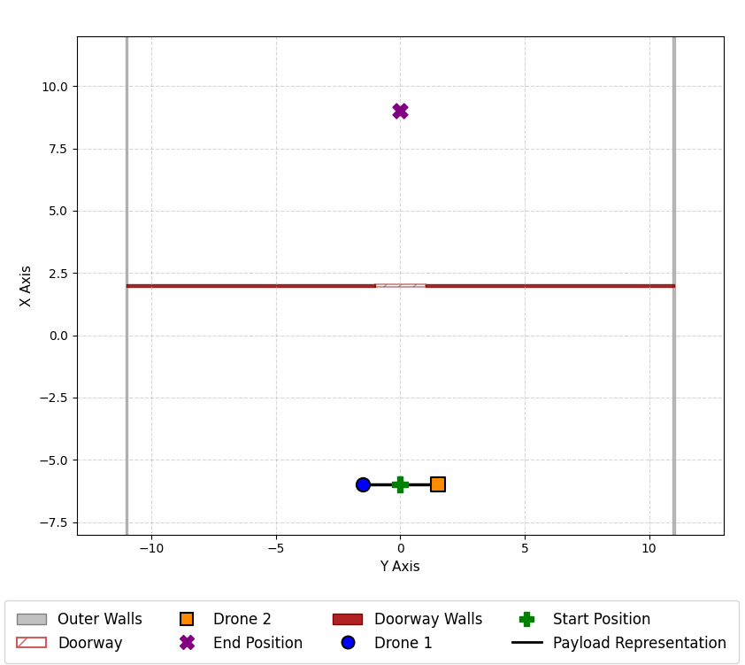
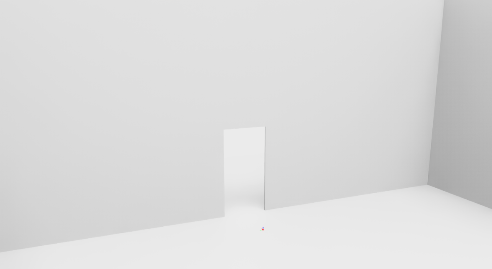
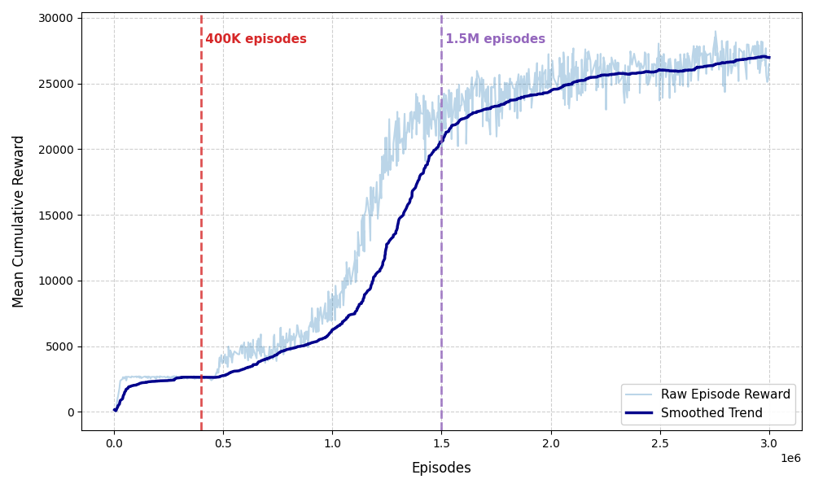
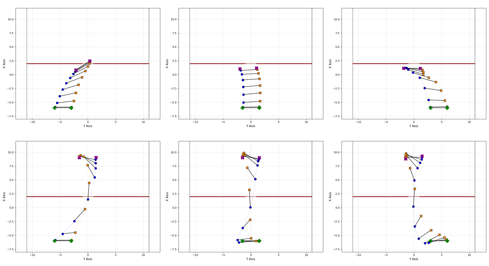

Thesis Draft (06/24/2026): [TA2_Naufal.pdf](https://github.com/user-attachments/files/29276683/TA2_Naufal.pdf)

# Deep Multi-Agent Reinforcement Learning for Cooperative Multi-UAV Payload Transportation

## Overview

This repository contains the implementation of my undergraduate thesis at Institut Teknologi Bandung (ITB). This thesis aims to analyze cooperative payload transportation of multi-UAV systems with Multi-Agent RL using NVIDIA's Isaac Lab, navigating through constrained environments.

## Objectives

- To construct a 6-degree-of-freedom (6-DoF) simulation environment in Isaac Sim, integrating the multi-UAV system and the payload, within a constrained environment.
- To configure and implement a decentralized MARL policy utilizing the Multi-Agent Proximal Policy Optimization (MAPPO) algorithm. Formulating the observation spaces, action spaces, reward functions, and termination conditions required to encourage the cooperative behavior between the UAVs.
- To analyze the resulting behavior of the cooperative spatial manipulation, analyzing asymmetric tilt maneuvers, and the coordination between the UAVs to successfully traverse the constrained environment while carrying the payload.

## Scope of Work

- The focus of this thesis would be on two quadcopter UAVs equipped with payload-carrying capabilities.
- The physical dynamics and control policies are analyzed in the 3D space.
- The 6-degree-of-freedom (6-DoF) rigid body dynamics and physical interactions between the UAVs and the environment are simulated in Isaac Sim, while the reinforcement learning policy is designed and simulated in Isaac Lab.
- The evaluation of the proposed MARL algorithm is done in a simulated environment, without real-world testing.
- The constrained environment is represented as a doorway, which is narrower than the shared payload of the multi-UAV system.

## Environment

  
  

## Results

### Videos

https://github.com/user-attachments/assets/3e9f20de-fcec-410b-8828-5abea6d9d15f

https://github.com/user-attachments/assets/baa25a6d-3c64-4abf-926b-ac409a05ebe0

https://github.com/user-attachments/assets/e31b37a8-f257-4277-96fd-cf88e382be82

### Learning Curve

  

### Trajectory Plots

  

Plots above show the results at 400K episodes (upper row), which shows the first reward plateau, and at 1.5M episodes (lower row), which shows the final reward plateau.

## Conclusion and Future Works

The resulting simulation has been successful, showing the multi-agent UAV system navigating through the doorway through combined asymmetric tilt behaviors.

This thesis attempted to integrate LiDARs to have an obstacle avoidance system. However, the model failed to learn with the LiDAR, and the scalability of the learning is not feasible. Further work needs to be done to attempt the obstacle avoidance system, such as having a model-based RL approach. Possibly start with a single agent and then work on the scalability. Besides that, further sim-to-real applications of the work need to be done, as the learned policy directly outputs thrust to the UAV. While this may work, the policy has not yet been evaluated with actuator dynamics, sensor noise, and typical low-level flight controllers capable of real applications.

## Comments

The structure of this repository is a cloned repo from ([Isaac Lab](https://github.com/isaac-sim/IsaacLab)), which was then added with another cloned repo from ([Zeng2025](https://github.com/Aerial-Manipulation-Lab/MARL_cooperative_aerial_manipulation_ext)) to implement the MAPPO skrl framework and drone model. The implementation of most of the thesis is located at \multirotor-isaaclab-naufal\source\isaaclab_tasks\isaaclab_tasks\manager_based\mr_v1\track_position_state_based\config\, having both single and multi-agent direct manager-based configurations.
